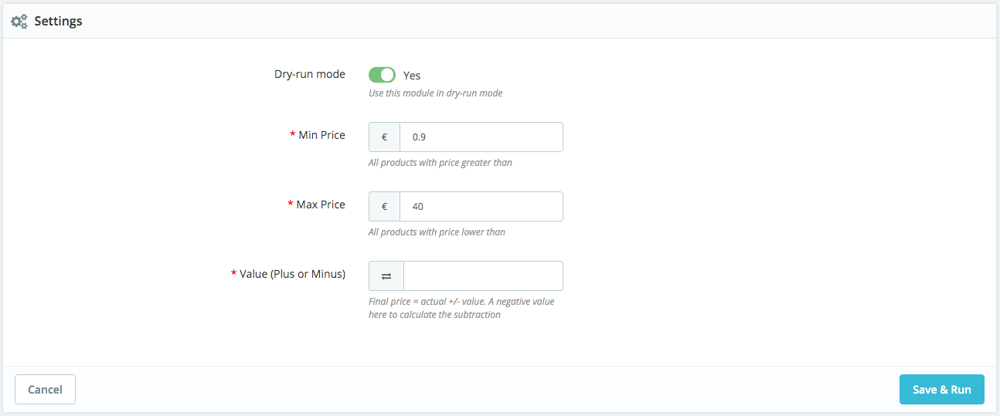
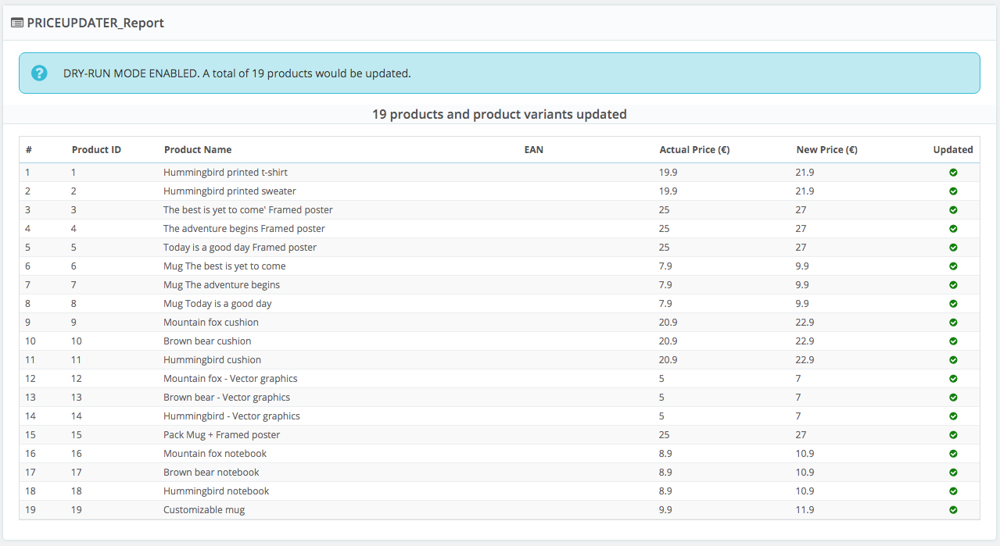
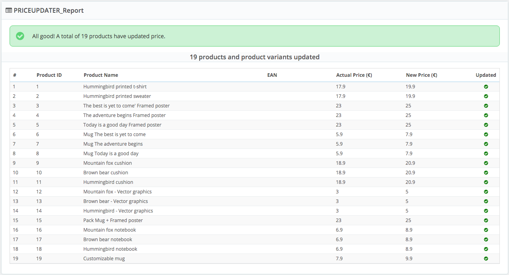

    <h1>Price Updater</h1>
    

## Overview

Prestashop module to easily update products prices based on pricethreshold.

## Prerequisites

- PHP version: 7.3 - higher
- Prestashop versions: 1.7.7.6 - higher

## Screenshots

### Settings

### Output

#### Dry-Run Mode

#### Live Mode

### License

[AFL-3.0](https://opensource.org/licenses/AFL-3.0)

Module icon by [Iconoir](https://iconoir.com/)
